# BILSTM-CRF

#### 条件随机场(CRF)简介

1. 要解决的问题：

   给定一组随机变量的条件下，另一组输出随机变量的概率分布模型。

   简单理解就是：从可选的标注序列中，选择最靠谱的一个序列。

   例如： 已知序列: 我  爱  中国

   ​            计算出最靠谱的标注序列：名词  动词  名词

2. 序列标注方法

- BMES标注法： B: Begin，M: mid， E: end， S: single(一个单独的字词)
- BIO 三位标注 (B-begin，I-inside，O-outside)
- BIOES (B-begin，I-inside，O-outside，E-end，S-single)

3. CRF原理

**发射分数**(状态分数)：从word_index到label_index设置一种分数，叫做发射分数emit，即E。如下图：word_index 的 1 -> 到label_index 的 4的小红箭头；

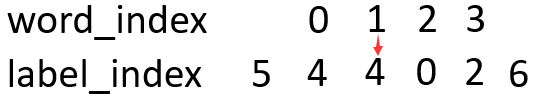

**转移分数**：前一个label到当前label的分数， 即T；如下图：横向的label到label箭头，就是由一个label到另一个label转移的意思，此时的分数为T[4] [4] 

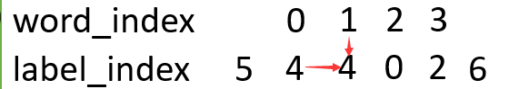

所以，此时的word_index=1到label_index=4的分数为emit[1] [4] + T[4] [4]。但是，CRF为了全局考虑，将前一个的分数也累加到当前分数上，这样更能表达出已经预测的序列的整体分数，最终的得分score为：

score[1] [4] = score[0] [4]+emit[1] [4]+T[4] [4]

所以整体的score就为：

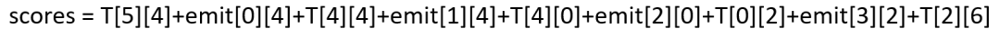

总结为公式为：
$$
score(X，y) = \sum_{i=0}^n{T_{y_i, y_{i+1}}} + \sum_{i=0}^n{E_{i, y_i}}
$$
其中：X为word_index序列，y为预测的label_index序列。

------

##### 损失函数

因为可能的预测序列有$n^m$种，需要从所有序列中选择出概率最大的序列。这个时候我们一般softmax化：
$$
P(\frac{y}{X}) = \frac{e^{s(X, y)}}{\sum_{\hat{y}\in{Y_X}}e^{s(X, \hat{y})}}
$$
其中：分子中的s为label序列为正确序列的score，分母s为每中可能的score。

这个比值越大，我们的预测就越准，所以，这个公式也就可以当做我们的loss，可是loss一般都越小越好，那我们就对这个加个负号即可，但是这个最终结果手机趋近于1的，我们实验的结果是趋近于0的，这时候log就派上用场了，即：
$$
-log(P(\frac{y}{X})) = -s(X, y) + log(\sum_{\hat{y}\in{Y_X}}e^{s(X, \hat{y})})
$$
所以，需要做的就是计算下面两个部分：
$$
-s(X, y) 
$$

$$
log(\sum_{\hat{y}\in{Y_X}}e^{s(X, \hat{y})})
$$

-----

#### BILSTM-CRF

工作流程：

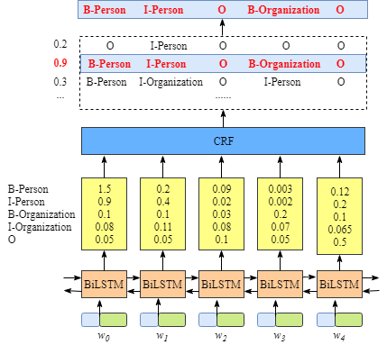

首先，句中的每个单词是一条包含词嵌入和字嵌入的词向量，词嵌入通常是事先训练好的，字嵌入则是随机初始化的。所有的嵌入都会随着训练的迭代过程被调整。

其次，**BiLSTM-CRF的输入是词嵌入向量**，输出是每个单词对应的预测标签。

如上图所示：BiLSTM层的输入表示该单词对应各个类别的分数。如W0，BiLSTM节点的输出是1.5 (B-Person), 0.9 (I-Person), 0.1 (B-Organization), 0.08 (I-Organization) and 0.05 (O)。这些分数将会是CRF层的输入。

最后:所有的经BiLSTM层输出的分数将作为CRF层的输入(**发射分数，也叫状态分数，即word->label的概率**)，CRF的输出类别序列中分数最高的类别就是我们预测的最终结果。

补充：

如果没有CRF层，可以选择BILSTM输出分数最高的类别作为预测结果，但是预测出来的结果序列是无序的。而CRF可以从训练数据中学习出一些约束信息(即转移矩阵)，提高预测的正确性。

-----

##### CRF层

**发射分数**：BILSTM层的输出，即word_index -> label_index的分数；

**转移分数**：从一个lable到另一个label的转移概率，lable包含所有label + start和end两个类标签，可以在训练前随机初始化转移矩阵的分数，这些分数将随着训练的迭代过程被更新，就是CRF层学到的约束条件。

**损失函数**：根据前面的总结，损失函数由两部分组成，一是真实路径的分数，二是所有路径的总分数。
$$
-log(P(\frac{y}{X})) = -s(X, y) + log(\sum_{\hat{y}\in{Y_X}}e^{s(X, \hat{y})})
$$

真实路径分数的计算比较简单。

**所有路径总分的计算**：

如下图所示：

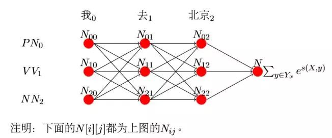

第一列：

首先说下，因为‘我’是第一列，前面没有别的词，所以就不用加上前 面的值。继续说，N[0] [0]表示‘我’选择PN的得分，N[1] [0]表示‘我’选 择V V 的得分,N[2] [0]表示‘我’选择NN的得分而该得分只有发射得分，所以为：

N[0] [0] = E[0] [0]

同理，得：

N[1] [0] = E[0] [1] N[2] [0] = E[0] [2]

第二列：

N[0] [1]表示前一个选择PN的得分+‘去’选择PN的得分（‘去’选 择PN的得分为T[0] [0]+E[1] [0]），前一个选择V V 的得分+加上‘去’选 择PN 的得分，加上前一个选择NN的得分+‘去’选择PN的得分。公式为：

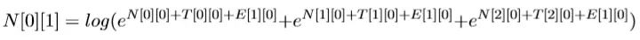

同理：

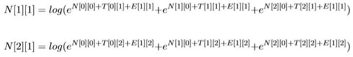

第三列：

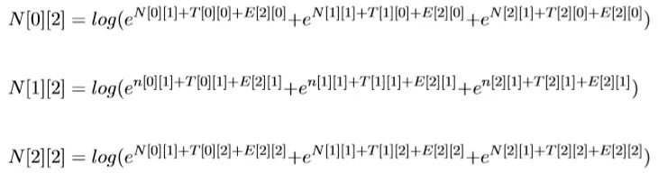

最后一列求完了，因为每个节点都包含了该节点之前所有节点到该节点的 可能路径，因为现在的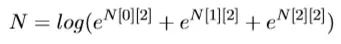的总和就是所有路径的总和，也就是我们要求的损失函数里面的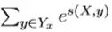。

-----

##### 预测过程

维特比算法：目的是选择可能性最高的序列，是一个动态规划算法。

算法过程：

每个节点选取得分最高的路径并记录得分和选的哪条路径：其中n^s_ij中的s表示前一条路径，没有的就是−1，nij表示前节点到当前节点的最佳得 分。 此时

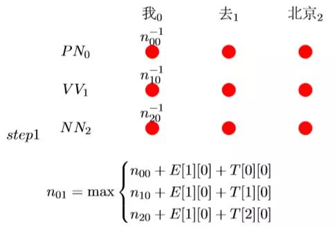

比如:此时预测n_20 + E[1] [0] + T[2] [0]为最高的，则记录n_01 = n_20 + E[1] [0] + T[2] [0]且路径为2，综上记为n^2_01:

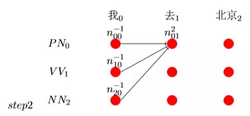

同理，我们假设有了step3的最终结果。

在最后我们假如n_22最大，而且它的前一个路径为1，则看到n_11的前一 个路径为0，而且n_00的前一个路径为−1，表示结束，则整个路径就有了， 即为n_00− > n_11− > n_22，如图step4：

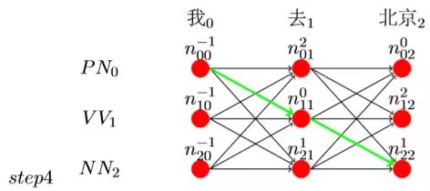

由step4得，最终(’我’，’去’，’北京’)的预测结果为：

(’我’− > PN，’去’− > V V ，’北京’− > NN)。

