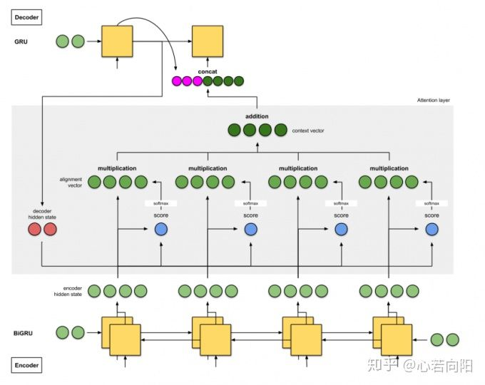

# Attention机制

##### Attention机制的本质思想：

从概念上理解，把Attention理解为**从大量信息中有选择的筛选出少量重要信息，并聚焦到这些重要信息上**，忽略太多不重要的信息。聚集的过程体现在**权重系数**的计算上，权重越大，越聚焦于其对应的value上。

从相似度或相关性上理解：attention将特征与目标进行相似度匹配，相似度越高，权重越大。

##### Attention具体计算过程：

- 根据query和key计算两者之间的相似性或相关性，得到注意力得分s1, s2, s3, s4；
- 对原始分值进行softmax归一化处理，得到权重系数a1, a2, a3, a4；
- 根据权重系数对value进行加权求和

##### self Attention

Query、key、value相同

优点：

- 引入self attention后更容易捕获句子中的长距离相互依赖的特征
- 可以增加计算的并行性

##### seq2seq中：

seq2seq中，encoder层的所有隐藏状态相当于key向量和value向量，decoder层的每一个隐藏层状态相当于query向量；

- 计算评分：query@key
- softmax归一化分数W1
- 使用W1对隐含层加权求和，value@W1，求和

