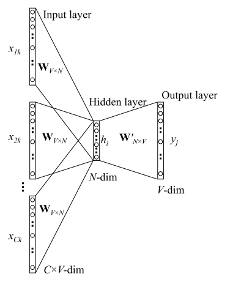

# word2vec

词向量的基本出发点是**上下文相似的两个词,它们的词向量也应该相似**。比如香蕉和梨在句子中可能经常出现在相同的上下文中，因此这两个词的表示向量应该就比较相似。

word2vec的两种模型：

- CBOW: 以上下文词汇预测当前词: $w_{t-1}, w_{t+1}$ 去预测 $w_t$
- SkipGram: 以当前词汇预测上下文：$w_t$ 去预测$w_{t-1}, w_{t+1}$


##### CBOW

模型图示如下;



输入： 多个词对应的one-hot表示，取出W中输入的所有C个单词的词向量，然后直接取平均

输出：预测词的one-hot表示，最后一层利用softmax预测目标词的概率


##### SkimGram

skimGram模型图示：


输入：一个词的one-hot表示

输出: 多个词，但多个词之间是相互的独立的，可以认为是一个词，最后一层利用softmax预测目标词的概率

##### 负采样(Negative Sampling)

负采样的思想便是每次训练只随机取一小部分的负例使他们的概率最小，以及对应的正例概率最大。

举例说明负采样：

```
有个样本phone number，这样wI=phone,wO=number, 正例就是number这个词， 负例就是不太可能与phone共同出现的词
```

在word2vec中，作者直接使基于词的频次的词的权重分布进行采样:
$$
weight(w) = \frac{count(w)^{0.75}}{\sum_u{count(w)^{0.75}}}
$$

##### 如何训练

###### 训练数据集构建

固定长度2n+1的滑动窗口，每次移动一步，遍历句子。其中，对于CBOW来说：每移动一步，生成一条训练数据，滑动窗口中第n+1个词为输出，两边的2n个词为输入；对于SkimGram来说：第n+1个词为输入，两侧的2n个词为输出，生成2n条训练数据。

###### 训练过程

首先，初始化词向量矩阵W；

然后，单词的one-hot乘以W，实际意义是去除单词对应的词向量；

再然后，使用该单词的词向量乘以权重矩阵W2，并在W2上做softmax变换，得到预测结果；

最后，预测结果与真实结果对比，计算loss；


反向传播，不仅要更新权重参数，还要更新数据。

###### 训练改进

如果词的数量较大，最后一层使用softmax训练时计算量会比较大。

改进办法是：输入两个单词，计算他们是不是前后对应的输入和输出，即把输入和输出同时输入刚给模型，计算概率。如下图示：


该方法需要结合负采样的方法，将我们得到的训练数据作为正样本，然后从语料库中随机生成一些没有上下文关系的单词对，作为负样本。例如：


##### 完整训练过程

1. 初始化词向量矩阵


2. 根据神经网络反向传播更新数据，不仅要更新权重参数矩阵w，也会更新输入数据。


##### 参考文献：

- [word2vec数学原理全家桶](http://shomy.top/2017/07/28/word2vec-all/)
- 


