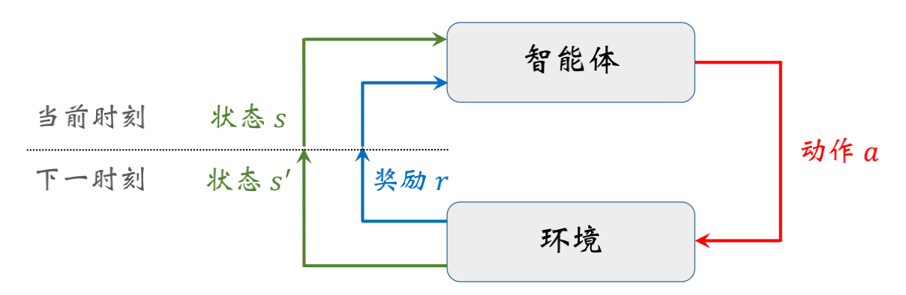
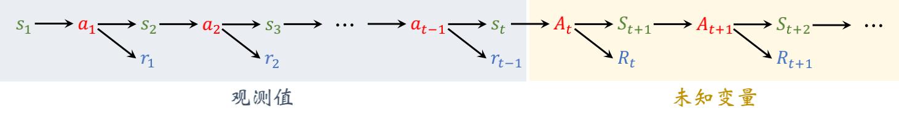

> 本文是对王树森教授强化学习课程的学习总结，原视频和课件地址： 
> 
> 视频地址：[https://youtu.be/vmkRMvhCW5c](https://youtu.be/vmkRMvhCW5c) 
> 
> 课件地址：[https://github.com/wangshusen/DeepLearning](https://github.com/wangshusen/DeepLearning) 

1. 智能体(agent) : 决策者或做动作的人，例如超级玛丽中的马里奥。

2. 环境(environment) : 环境是与agent交互的对象，可以抽象地理解为交互过程中的规则或机理。在超级玛丽游戏中，环境就是游戏程序。

3. 状态(state) : 每一时刻，都有一个状态，可以理解为对当前时刻环境的概括。在超级马里奥游戏中，可以把当前屏幕的画面(或最近几帧画面)当做状态。一般用s表示。

4. 动作(action): agent基于当前环境状态所做的决策。例如马里奥向左、向右、向上的动作。一般用过a表示。
4. 动作空间：所有可能动作的集合，记作$A$。

6. 状态空间 : 所有可能存在的状态集合，记作$S$。可以是离散的，也可以是连续的；可能是有限的，也可能是无限的。  

7. 状态转移：智能体从当前 t 时刻的状态 s 转移到下一个时刻状态为 s′的过程。状态转移通常是随机的，其随机性来自于环境。使用*状态转移概率函数*来描述状态转移，记作：  
   $$ p_t(s'|s, a) = P(S_{t+1}^{'}=s'|S_t=s, A_t=a) $$
   表示这个事件的概率：在当前状态$s$，智能体执行动作$a$，环境的状态变成$s'$

8. 奖励(reward): 指在智能体执行一个动作之后，环境返回给智能体的一个数值。奖励定义得好坏对强化学习的结果有非常大的影响。 通常奖励是当前状态s、当前动作a、下一时刻状态 s′的函数，记作: $r(s, a, s')$ 。通常假设奖励函数是有界的，即对于所有的$a ∈ A$ 和$s,s'∈S$，有$|r(s, a, s′)| < \infty$   。

9. 策略(policy)：指的是根据观测到的状态，如何做出决策，即如何从动作空间中选取一个动作。强化学习的目标就是得到一个策略函数，在每个时刻根据观测到的状态做出决策。 
   - 随机策略：随机策略函数$\pi$是一个概率密度函数：$\pi(a|s) = P(A=a|S=s)$，策略函数的输入是状态$s$ 和动作$a$, 输出是一个0到1之间的概率值。
   - 确定策略：记作：$\mu: S -> A$ ， 输入为状态$s$，输出为$a=\mu(s)$。 

10. agent与环境的交互过程: 是指agent观测到环境的状态$s$，做出动作 $a$，动作会改变环境的状态，环境反馈给agent奖励 *r* 以及新的状态 $s'$。如下图所示：

11. 回合(episodes): 指agent从游戏开始到通关或结束的过程。

12. 随机性的来源 
    - 动作的随机性：动作的随机性来自于*随机决策*的过程。给定当前状态$s$, 策略函数$\pi(a|s)$ 会算出动作空间$A$中每个动作的概率值，agent执行的动作是随机抽样的结果。
    - 状态的随机性：状态的随机性来自于状态转移函数$p_t(s'|s, a)$, 即便状态和动作确定，下一个状态仍然具有随机性。
    - t时刻的奖励记作$r_t=r(s_t, a_t)$, 是由当前状态和动作决定的，如果当前状态和动作已经观测到，那么奖励$r_t$也是确定的；如果$A_t$还没观测到，或者$(S_t, A_t)$都没被观测到，则t时刻的奖励$R_t=r(s_t, A_t)$ 或 $R_t=r(S_t, A_t)$ 就有不确定性。

13. 回报(return)与折扣回报

    - 回报：从当前时刻开始，到本回合结束的所有奖励的总和，所以回报也叫累计奖励。t时刻的回报记作$U_t$ 。如果一个回合结束，已经观测到所有奖励，那么就把回报记作$u_t$ 。   $ U_t = R_t + R_{t+1} + R_{t+2} + \cdots + R_n $ 。强化学习的目标是最大化回报，而不是最大化奖励。

    - 折扣回报：对未来的奖励做折扣，降低未来奖励对回报的贡献度。$ U_t = R_t + \gamma \cdot R_{t+1} + \gamma^2 \cdot R_{t+2} + \gamma^3 \cdot R_{t+3} + \cdots $   这里$\gamma \epsilon [0, 1]$ 叫作折扣率。
    - 回报中的随机性：如下图所示，agent的轨迹中$s_t$及其之前的状态、动作、奖励都被观测到，而$A_t$ 及其之后的状态、动作、奖励都是未知变量。

    

14. 价值函数

    - **动作价值函数**：假设已经观测到状态$s_t$ ，且已做完决策，选中动作$a_t$ ，那么$U_t$的随机性来自于$S_{t+1}, A_{t+1}, S_{t+2}, A_{t+2}, \cdots, S_n, A_n$。 对$U_t$关于$S_{t+1}, A_{t+1}, S_{t+2}, A_{t+2}, \cdots, S_n, A_n$ 求条件期望，得到：$ Q_{\pi}(s_t, a_t) = E_{S_{t+1}, A_{t+1}, \cdots, S_n, A_n} \big[ U_t|S_t=s_t, A_t=a_t\big] $   

      其中：$S_t=s_t, A_t=a_t$ 为条件，意思是已经观测到$S_t$ 和$A_t$ 的值。$Q_{\pi}(s_t, a_t)$即为**动作价值函数**。

      t时刻的动作价值函数依赖于以下三个因素：

      - 当前状态$s_t$ : 当前状态越好，$Q_{\pi}(s_t, a_t)$越大。
      - 当前动作$a_t$：agent执行的动作越好，$Q_{\pi}(s_t, a_t)$越大。
      - 策略函数$\pi$：策略的好坏决定未来动作的好坏，策略越好，$Q_{\pi}(s_t, a_t)$越大。

    - **最优动作价值函数**：假设有很多种策略可供选择，我们选择最好的策略函数：$\pi^* = _{\pi}^{argmax}Q_\pi(s_t, a_t),     \forall s_t \epsilon S, a_t \epsilon A$ 。

      - 最优动作价值函数记作：$ Q_*(s_t, a_t) = _t^{max} Q_\pi(s_t, a_t),  \forall s_t \epsilon S, a_t \epsilon A $ 。

      - 消除了对$\pi$ 的依赖，只依赖于$s_t, a_t$ 。

    - **状态价值函数**：用来衡量已知当前状态$s_t$ 时，游戏的胜算有多大。状态价值函数的定义：$ V_\pi(s_t) = E_{A_t\sim\pi(\cdot|s_t)}\big[Q_\pi(s_t, A_t)\big] = \sum_{a \epsilon A}\pi(a|s_t)\cdot Q_\pi(s_t, a)  $  
      - 意义：对于当前状态$s_t$ ，计算每个可能得动作$a$ 的概率，以及选择动作$a$时的产生的价值，概率乘以价值再求和，得到对于$A_t$动作空间的期望，消除$A_t$ 
      - 只依赖于策略函数$\pi$和$s_t$ ， 用状态价值可以衡量策略$\pi$与状态 $s_t$ 的好坏

    动作价值函数与状态价值函数的本质区别与联系：

    - 二者本质上都是对回报的期望。不同的是，动作价值函数已知当前状态$s_t$和当前动作$a_t$，对t+1时刻之后的状态和动作$S_{t+1}, A_{t+1}, S_{t+2}, A_{t+2}, \cdots, S_n, A_n$求期望；状态价值函数是已知当前状态$s_t$，但是即将选择的动作未知，对$A_t, S_{t+1}, A_{t+1}, S_{t+2}, A_{t+2}, \cdots, S_n, A_n$求期望。

